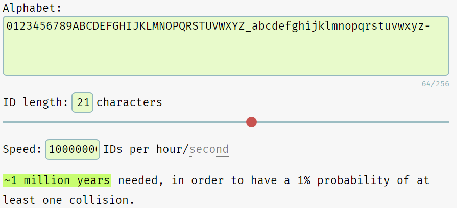
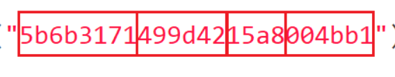

## 一.UUID

### 优点

使用UUID作为主键具有以下优点：

#### 1.分布式ID

UUID值在表，数据库甚至在服务器上都是唯一的，允许您从不同数据库合并行或跨服务器分发数据库。

#### 2.安全性

UUID值不会公开有关数据的信息，因此在URL中使用更安全。

#### 3.通用性

可以在避免往返数据库服务器的任何地方生成UUID值。它也简化了应用程序中的逻辑。

### 缺点

除了优势之外，UUID值也存在一些缺点：

#### 1.存储空间多

存储UUID值(16字节)比整数(4字节)或甚至大整数(8字节)占用更多的存储空间。

#### 2.调试似乎更加困难

想象一下WHERE id ='9d6212cf-72fc-11e7-bdf0-f0def1e6646c'和WHERE id = 10哪个舒服一点？

#### 3.性能问题

使用UUID值可能会导致性能问题，因为它们的大小和没有被排序。


## 二.雪花算法

## 三.NanoID

UUID 是软件开发中最常用的通用标识符之一。然而，在过去的几年里，其他的竞品挑战了它的存在。其中，NanoID 是 UUID 的主要竞争对手之一。但是，这两者之间的主要区别很简单。它归结为键所使用的字母表。由于 NanoID 使用比 UUID 更大的字母表，因此较短的 ID 可以用于与较长的 UUID 相同的目的。

### 优点

#### 1.NanoID的大小只有108字节

与UUID不同，NanoID的大小比UUID小4.5倍，并且没有任何依赖性。这直接影响数据的大小。例如，使用NanoID的对象对于数据传输和存储来说既小又紧凑。随着程序的增长，这些特点将变得显而易见。

#### 2.更安全

在大多数随机生成器中，它们使用不安全的Math.random()。但是，NanoID使用更安全的crypto module和 Web Crypto API。此外，NanoID在ID生成器的实现过程中使用了自己的算法，称为uniform algorithm，而不是使用random % alphabet.

#### 3.速度快，结构紧凑

NanoID比UUID快60%。在UUID的字母表里有36个字符，而NanoID只有21个字符。

#### 4.更多语言

NanoID 支持 14 种不同的编程语言，它们分别是：C#、C++、Clojure 和 ClojureScript、Crystal、Dart & Flutter、Deno、Go、Elixir、Haskell、Janet、Java、Nim、Perl、PHP、带字典的 Python、Ruby、Rust、Swift。

#### 5.自定义字母，和长度

NanoID 的另一个现有功能是它允许开发人员使用自定义字母表。我们可以更改文字或 id 的大小

```java
/**
 * The default alphabet used by this class.
 * Creates url-friendly NanoId Strings using 64 unique symbols.
 */
public static final char[] DEFAULT_ALPHABET = "_-0123456789abcdefghijklmnopqrstuvwxyzABCDEFGHIJKLMNOPQRSTUVWXYZ".toCharArray();

/**
 * The default size used by this class.
 * Creates NanoId Strings with slightly more unique values than UUID v4.
 */
public static final int DEFAULT_SIZE = 21;
```

#### 6.没有第三方依赖

由于 NanoID 不依赖任何第三方依赖，随着时间的推移，它能够变得更加稳定自治。从长远来看，这有利于优化包的大小，并使其不太容易出现依赖项带来的问题。

### 缺点

[Nano ID Collision Calculator] : <https://zelark.github.io/nano-id-cc/>

从官方给出的碰撞计算测试来看

每秒生成一亿个ID，100万年有1%的重复概率。比uuid还是差不少




## 四.mongoDB的ObjectId

ObjectID 长度为 12 字节，由几个 2-4 字节的链组成。每个链代表并指定文档身份的具体内容。以下的值构成了完整的 12 字节组合：

一个 4 字节的值，表示自 Unix 纪元以来的秒数

一个 3 字节的机器标识符

一个 2 字节的进程 ID

一个 3 字节的计数器，以随机值开始



## 七.参考资料：

[github] : <https://github.com/aventrix/jnanoid>

[Why is NanoID Replacing UUID?] : <https://blog.bitsrc.io/why-is-nanoid-replacing-uuid-1b5100e62ed2>

[译 为什么 NanoID 会取代 UUID] : <https://zhuanlan.zhihu.com/p/387924041>
